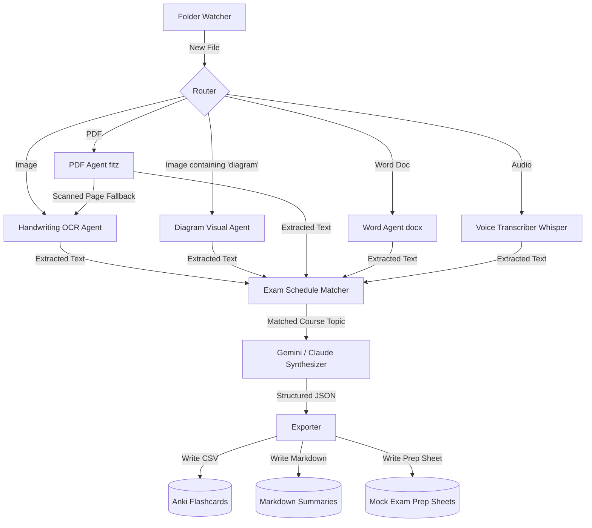

# 🧠 StudyMind

[](#-dual-llm-backend-configuration)
[](#-offline-local-whisper-mode)
[](#)
[](#)

StudyMind is an intelligent multi-modal desktop agent designed to automate the collection, transcription, and synthesis of academic lectures, handwritten notes, and voice recordings. By watching a target folder on your filesystem, it automatically processes, tags, and organizes incoming learning resources into structured study summaries, mock exams, and Anki-importable flashcards.

---

## 🏗️ Multi-Agent Architecture



### 1. Watchdog File Observer
Monitors a folder (`watch_dir` in `config.yaml`). To prevent locking and read errors on large documents or voice memos, the watcher spawns background threads that wait until the file size is fully stabilized and unlocked by the OS before starting the routing pipeline.

### 2. Parallel Routing Agents
Files are routed to specialized extraction agents based on extension type:
*   **Handwriting Agent**: Extracts clean Markdown structures from handwritten notebook snapshots.
*   **Diagram Agent**: Interprets visual mechanics, graphs, and mind-maps, writing textual processes.
*   **PDF Agent**: Parses text via PyMuPDF. If a page is scanned (no text layer), it renders the page image in-memory and invokes the LLM Vision OCR.
*   **Word Agent**: Extracts Word text and tabular data grids.
*   **Voice Agent**: Transcribes voice recordings using OpenAI Whisper (Cloud) or offline faster-whisper (Local).

### 3. Exam Schedule Planner & LLM Synthesizer
*   **Planner**: Compares the file contents against your upcoming courses and priority topics listed in `config.yaml` to categorize the file correctly.
*   **Synthesizer**: Prompts the LLM (Gemini 1.5 Pro or Claude 3.5 Sonnet) to compile high-yield study materials (Markdown concept summaries, Anki-ready flashcards, mock exam questions, and memory hooks/*Eselsbrücken*).
*   **Exporter**: Saves structured cards into `output/anki/` (standard CSV format), summaries into `output/summaries/`, and test sheets into `output/exam_prep/`.

---

## ⚙️ Configuration & Features

### 🔌 Dual LLM Backend Configuration
You can configure which LLM provider to use in [config.yaml](./config.yaml):

```yaml
models:
  llm_provider: "gemini"             # "gemini" (Free flagship) or "claude" (Paid)
  claude: "claude-3-5-sonnet-20241022"
  gemini: "gemini-1.5-pro"           # Flagschip-reasoning model
```

*   **Google Gemini 1.5 Pro**: Offers zero-cost API requests under Google AI Studio's free tier. Features native structured JSON schema enforcement.
*   **Anthropic Claude 3.5 Sonnet**: Industry-standard code generation and reasoning (requires a paid key).

### 🎙️ Offline Local Whisper Mode
To transcribe voice memos 100% free offline, toggle local mode in [config.yaml](./config.yaml):

```yaml
models:
  whisper_mode: "local"              # "local" for offline free transcription, "api" for OpenAI API
  whisper_local_model: "base"         # "tiny", "base", "small", "medium"
```

---

## 🚀 Getting Started

### 1. Installation
Clone the repository, configure a virtual environment, and install dependencies:
```bash
python -m venv venv
source venv/Scripts/activate  # On Windows: venv\Scripts\activate
pip install -r requirements.txt
```

### 2. API Keys Configuration
Create a `.env` file in the `studymind` directory. The application is configured with **intelligent startup checks**, so it only requires the keys that are active in your `config.yaml`:

```env
# Required if llm_provider is "gemini"
GEMINI_API_KEY=your_google_gemini_key

# Required if llm_provider is "claude"
ANTHROPIC_API_KEY=your_anthropic_api_key

# Required only if whisper_mode is "api"
OPENAI_API_KEY=your_openai_api_key
```

### 3. Configure Your Course Schedule
Open [config.yaml](./config.yaml) and customize your academic course names, exam dates, and priority topic keywords. This ensures that any uploaded resource is matched to the correct course.

### 4. Running the Application
```bash
python main.py
```
*   A system tray icon with a **green brain** will appear in the taskbar.
*   Drop any study file (PDF, slide screenshot, handwritten note image) into the watched folder (default: `./watch_folder`).
*   **Global Hotkeys**:
    *   Press **`Ctrl+Shift+X`** to take a screenshot of your primary display (ideal for OneNote capturing!).
    *   Press **`Ctrl+Shift+R`** to toggle quick mic recording.
*   Watch the desktop overlay track progress and notify you when your flashcards and summaries are ready!

---

## 🧪 Automated Tests
Run the test suite using pytest to verify code logic and mocks:
```bash
python -m pytest tests/
```
